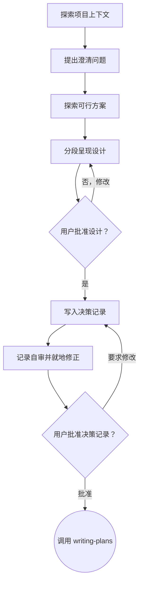

# 将想法通过头脑风暴转化为设计

通过自然、协作式的对话，帮助用户把想法转化为完整的设计和规格说明。

首先理解当前项目的上下文，然后围绕当前决策主题提出少量、相关的问题，逐步澄清想法。一旦理解了要构建什么，就呈现设计并获得用户批准。

<HARD-GATE>
在呈现设计并获得用户批准之前，不得调用任何实施类 Skill、编写任何代码、搭建任何项目脚手架，也不得采取任何实施行动。无论项目看起来多么简单，这条规则都适用于每一个项目。
</HARD-GATE>

## 反模式：“这太简单了，不需要设计”

用户授权进入本 Skill 后，每个项目都必须经过这个过程。待办事项列表、单函数工具、配置修改——无一例外。“简单”的项目最容易因为未经检验的假设而浪费大量工作。对于真正简单的项目，设计可以很短（几句话即可），但你必须呈现设计并获得批准。

## 检查清单

你必须为以下每一项创建一个任务，并按顺序完成：

1. **探索项目上下文**——检查文件、文档和近期提交
2. **默认使用 Markdown 表达设计**——按需使用简洁文字、表格、文本树或 Mermaid。Visual Companion 只作为例外入口，参见下方章节。
3. **提出澄清问题**——每条消息围绕一个决策主题，提出 1～3 个简短且相互关联的问题，理解目的、约束和成功标准
4. **探索可行方案**——存在重要且合理的替代路径时，比较 2～3 种方案；否则直接给出推荐方案
5. **呈现设计**——按复杂程度分段呈现，在会影响后续内容的关键决策点请求确认，最后获得整体批准
6. **记录已批准的设计决策**——按下方规则写入决策文件，不得自动提交 Git
7. **记录自审**——快速就地检查占位内容、矛盾、歧义和范围（见下文）
8. **用户审阅决策记录**——继续之前，请用户审阅记录文件
9. **过渡到实施**——调用 writing-plans Skill 创建实施计划

## 流程图

**流程的终点是调用 writing-plans。** 不得调用 frontend-design、mcp-builder 或任何其他实施类 Skill。brainstorming 之后唯一可以调用的 Skill 是 writing-plans。

## 具体过程

**理解想法：**

- 首先检查项目当前状态（文件、文档、近期提交）
- 在询问细节之前先评估范围：如果请求包含多个彼此独立的子系统（例如“构建一个包含聊天、文件存储、计费和数据分析的平台”），立即指出这一点。不要花时间细化一个本应先拆分的项目。
- 如果项目规模过大，无法由一份规格说明覆盖，就帮助用户把它拆成多个子项目：哪些部分相互独立，它们之间是什么关系，应按什么顺序构建？然后按照正常设计流程，对第一个子项目进行头脑风暴。每个子项目都分别经历规格说明 → 计划 → 实施的周期。
- 对于范围适当的项目，每条消息围绕一个决策主题，提出 1～3 个简短且相互关联的问题；如果前一个答案会决定后一个问题，就每次只问一个
- 尽可能优先使用选择题，开放式问题也可以
- 能从项目文件、文档或已有上下文推断的信息，不要再询问用户
- 重点理解：目的、约束和成功标准
- 进入方案比较前，如果存在多个关键假设、多个角色或子系统、相互冲突的约束，或高成本且难以撤销的决策，先综合总结当前理解，包括目标、约束、成功标准、范围外内容和关键假设，并请用户确认。不要逐句复述用户原话

**探索方案：**

- 先判断是否存在会实质影响结果的重要替代路径
- 如果最佳路径明显，或修改简单、明确且可逆，只呈现推荐方案，不要为了满足数量而制造选项
- 如果存在重要且合理的替代路径，提出 2～3 种有实质差异的方案，并说明关键取舍、成本、风险和适用条件
- 以对话方式呈现选项，并给出你的建议和理由
- 先给出你推荐的方案，再解释原因
- 用户选定后，以该方案作为当前基线继续推进。如果后来发现可能显著改善结果的新方案，先简要说明它的价值和重新比较的成本，再询问用户是否重新打开方案比较；未经用户同意，不得自行重新发散
- 严格遵循 YAGNI——从每种方案和设计中删除不必要的功能

**呈现设计：**

- 当你确信自己已经理解要构建什么时，呈现设计
- 每个部分的篇幅应与其复杂程度相称：简单内容用几句话，复杂内容最多约 200～300 词
- 默认在 Markdown 中呈现：流程、状态变化和组件关系使用 Mermaid；多方案对比使用表格；层级关系使用文本树或 Mermaid
- 只有视觉表达能明显降低理解成本时才画图；不要为了图文并茂而强制增加图表
- 在会影响后续设计的关键决策点请求确认，例如范围、核心架构、数据或权限边界；简单、连续且可逆的部分可以合并呈现
- 不要机械地逐段停下来等待批准；用户没有异议时继续推进
- 完整设计呈现后，必须获得用户整体批准，才能写入决策记录并进入后续流程
- 覆盖：架构、组件、数据流、错误处理和测试
- 如果有内容不清楚，随时返回并继续澄清

**为隔离性和清晰度而设计：**

- 把系统拆成更小的单元；每个单元都应只有一个清晰的职责，通过定义明确的接口通信，并且能够独立理解和测试
- 对每个单元，你都应该能够回答：它做什么、怎样使用、依赖什么？
- 不阅读内部实现，别人能否理解一个单元的作用？修改内部实现时，能否不破坏使用方？如果不能，就需要改进边界。
- 更小、边界清晰的单元也更便于你处理——当代码能一次完整放入上下文时，你能更好地推理；文件职责集中时，你的修改也更可靠。文件不断变大，往往说明它承担了太多职责。

**在现有代码库中工作：**

- 提出修改方案前，先探索当前结构并遵循现有模式
- 如果现有代码存在会影响本次工作的缺陷（例如文件过大、边界不清、职责纠缠），把有针对性的改善纳入设计——优秀的开发者会改善自己正在处理的代码
- 不要提出无关的重构。只关注服务于当前目标的内容

## 设计之后

**决策记录：**

- 把已批准的设计写成简洁、可执行的决策记录；内容至少包括背景、决策、关键理由、边界与约束、验收标准
- 如果当前工作是在维护 `my-skills/` 中的个人 Skill，写入 `my-skills/decisions/<skill-name>/YYYY-MM-DD-<topic>.md`
  - `<skill-name>` 使用被维护 Skill 的名称，不使用 `brainstorming`
  - 同一 Skill 的后续决策继续放在它自己的目录中
- 其他项目优先遵循用户指定位置或项目已有约定；两者都不存在时，先询问用户，不要擅自创建新的文档目录规范
- 如果 elements-of-style:writing-clearly-and-concisely Skill 可用，则使用它
- 写入文件后不得自动执行 Git commit；只有用户明确要求提交时才提交

**记录自审：**
写完决策记录后，用全新的视角检查它：

1. **占位内容扫描：** 是否还有 “TBD”、“TODO”、未完成的章节或模糊需求？修正它们。
2. **内部一致性：** 各章节之间是否存在矛盾？架构是否与功能描述一致？
3. **范围检查：** 范围是否足够集中，可以由一份实施计划覆盖？还是需要进一步拆分？
4. **歧义检查：** 是否有需求可能被理解成两种不同含义？如果有，选择一种并明确写出。

直接修正发现的问题。无需重新审阅——修正后继续。

**用户审阅关卡：**
记录自审通过后，请用户审阅决策记录，再继续：

> “决策记录已写入 `<path>`，尚未提交 Git。请审阅；在我们开始编写实施计划之前，如果你希望修改任何内容，请告诉我。”

等待用户回复。如果用户要求修改，就完成修改并重新进行记录自审。只有在用户批准后才能继续。

**实施：**

- 调用 writing-plans Skill 创建详细的实施计划
- 不得调用任何其他 Skill。下一步是 writing-plans。

## Visual Companion

Visual Companion 是一个可选的浏览器交互工具，不是默认设计流程。普通的结构图、流程图、状态图、布局说明和方案比较，都应直接在 Markdown 中完成。

只在以下任一条件成立时考虑启用：

- 用户主动要求交互式演示、可点击模型图或浏览器中的视觉比较
- 设计包含复杂交互、空间布局或多状态动态变化，静态 Markdown 无法让用户有效判断

仅仅“看图更直观”不构成启用理由；Mermaid、表格或文本树能够说清楚时，继续使用 Markdown。

如果用户已经主动明确要求使用 Visual Companion，可以直接进入该流程。否则，即使你判断确有必要，也必须先单独发送以下询问：
> “这部分包含复杂的交互或动态变化，静态 Markdown 不足以清楚演示。我可以启动 Visual Companion，在浏览器里演示；会增加一些操作和 token 消耗。要启动吗？”

**这条询问必须独占一条消息。** 等待用户回复；同意后才使用 `--open` 启动服务器。用户拒绝后，退回 Markdown，并且不要再次询问，除非用户主动提出。

如果用户同意使用 Visual Companion，请在继续之前阅读详细指南：
`visual-companion.md`
