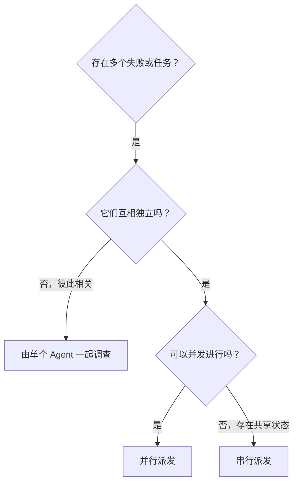

# 并行派发子 Agent

## 概述

你把任务委派给上下文隔离的专门 Agent。通过精确构造它们的指令和上下文，让它们保持聚焦并完成任务。它们不应继承你当前会话的上下文和历史，而是由你构造它们真正需要的信息。这同时保护了你自己的上下文，用于协调工作。

当存在多个互不相关的失败（不同测试文件、不同子系统、不同 Bug）时，逐个串行调查会浪费时间。每项调查都相互独立，可以并行进行。

**核心原则：** 每个独立问题域派发一个子 Agent，让它们并发工作。

## 调用前提

- 用户显式调用本 Skill 时直接使用。
- 否则先说明当前具体问题、并行派发的预期收益和主要成本，获得用户明确同意后才开始派发。
- 不要为了使用本 Skill 而把本可以顺手完成的少量工作拆成多个子 Agent。

## 何时使用



**使用：**

- 3 个以上测试文件失败，且根因各不相同
- 多个子系统各自独立损坏
- 每个问题都可以在不了解其它问题的情况下理解
- 各项调查之间没有共享状态

**不使用：**

- 各个失败彼此相关（修好一个可能连带修好其它）
- 需要先理解系统的整体状态
- 各个 Agent 会互相干扰

## 模式

### 1. 识别独立问题域

按“坏掉的是什么”对失败分组：

- 文件 A 的测试：工具审批流程
- 文件 B 的测试：批处理完成行为
- 文件 C 的测试：中止功能

每个域相互独立——修复工具审批不会影响中止相关的测试。

### 2. 构造聚焦的 Agent 任务

每个 Agent 都要拿到：

- **明确范围：** 一个测试文件或一个子系统
- **清晰目标：** 让这些测试通过
- **约束条件：** 不要改动其它代码
- **期望输出：** 你发现了什么、修改了什么的总结

### 3. 并发派发

在同一轮中发出全部派发调用，它们才会并发运行：

```text
子 Agent（通用）："修复 agent-tool-abort.test.ts 的失败"
子 Agent（通用）："修复 batch-completion-behavior.test.ts 的失败"
子 Agent（通用）："修复 tool-approval-race-conditions.test.ts 的失败"
# 三个同时运行。
```

同一轮中发出多个派发调用即并发执行；每轮只发一个就是串行。多 Agent 能力的开关、生成与等待工具在不同平台上并不相同，需要时读取当前运行环境对应的平台参考，不要凭印象猜测工具名称。

### 4. 回收与整合

Agent 返回后：

- 阅读每份总结
- 确认各项修改没有冲突
- 运行完整测试套件
- 整合全部改动

## 子 Agent 提示结构

好的 Agent 提示具备三点：

1. **聚焦**——一个清晰的问题域
2. **自足**——包含理解该问题所需的全部上下文
3. **输出明确**——说明 Agent 应该返回什么

```markdown
修复 src/agents/agent-tool-abort.test.ts 中 3 个失败的测试：

1. "should abort tool with partial output capture"——期望消息中包含 'interrupted at'
2. "should handle mixed completed and aborted tools"——快速工具被中止而不是完成
3. "should properly track pendingToolCount"——期望 3 个结果，实际得到 0 个

这些是时序或竞态条件问题。你的任务：

1. 读取测试文件，理解每个测试验证什么
2. 定位根因——是时序问题还是真实 Bug？
3. 通过以下方式修复：
   - 用基于事件的等待替换任意超时
   - 如果发现中止实现中的 Bug，就修复它
   - 如果被测行为确实变了，就调整测试期望

不要只是调大超时——找到真正的问题。

返回：你发现了什么、修改了什么的总结。
```

## 常见错误

**❌ 过于宽泛：** “修复所有测试”——Agent 会迷失
**✅ 具体：** “修复 agent-tool-abort.test.ts”——范围聚焦

**❌ 没有上下文：** “修复那个竞态条件”——Agent 不知道在哪里
**✅ 有上下文：** 贴上错误信息和测试名称

**❌ 没有约束：** Agent 可能顺手重构一切
**✅ 有约束：** “不要改动生产代码”或“只修改测试”

**❌ 输出含糊：** “修好它”——你不知道改了什么
**✅ 输出明确：** “返回根因和改动的总结”

## 何时不要使用

**相关的失败：** 修好一个可能连带修好其它——先一起调查
**需要完整上下文：** 理解问题必须看到整个系统
**探索式调试：** 你还不知道坏在哪里
**共享状态：** Agent 之间会互相干扰（编辑同一批文件、占用同一资源）

## 实际案例

**场景：** 一次较大的重构后，3 个文件共出现 6 个测试失败

**失败：**

- agent-tool-abort.test.ts：3 个失败（时序问题）
- batch-completion-behavior.test.ts：2 个失败（工具未执行）
- tool-approval-race-conditions.test.ts：1 个失败（执行计数为 0）

**判断：** 属于独立问题域——中止逻辑、批处理完成、竞态条件互不相关

**派发：**

```text
Agent 1 → 修复 agent-tool-abort.test.ts
Agent 2 → 修复 batch-completion-behavior.test.ts
Agent 3 → 修复 tool-approval-race-conditions.test.ts
```

**结果：**

- Agent 1：用基于事件的等待替换了超时
- Agent 2：修复了事件结构 Bug（threadId 放错位置）
- Agent 3：补上了对异步工具执行完成的等待

**整合：** 三处修复互相独立，没有冲突，完整套件通过

## 验证

Agent 返回后：

1. **审阅每份总结**——理解改了什么
2. **检查冲突**——各个 Agent 是否改了同一段代码？
3. **运行完整套件**——确认这些修复放在一起仍然有效
4. **抽查**——Agent 可能犯系统性错误
