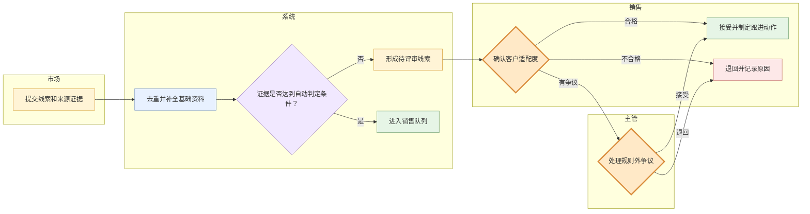
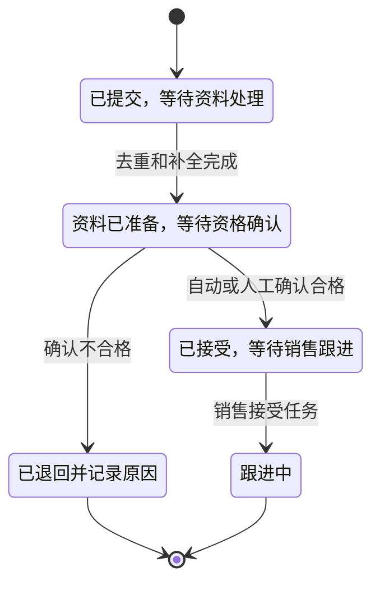

# 业务流程示例：销售线索资格确认与交接

## 使用场景

读者需要理解市场、系统、销售和主管之间怎样交接，哪些结果能自动前进，哪些必须人工判断。

## 第一层：角色分区流程

分区表达责任边界，箭头表达交付。紫色是规则或模型判断，橙色是人必须承担责任的判断，二者不能用同一种“审核中”状态代替。

## 第二层：线索业务状态

“等待谁做什么”写进状态含义；通知、分配队列和提醒属于系统动作，不加入线索的业务生命周期。

## 第三层：核心护栏

| 护栏 | 业务含义 |
|---|---|
| 来源可追溯 | 每条线索保留来源和证据，不只保留整理后的结果 |
| 自动判定可解释 | 只有满足明确条件时才能跳过人工确认 |
| 退回必须有原因 | 不合格不是删除，原因用于后续规则修正 |
| 争议有责任人 | 规则外情况升级给主管，不在多个队列间循环 |

## 不推荐的呈现

- 只画“收集 → 清洗 → 审核 → 分配”，看不出谁负责以及审核对象是什么。
- 把自动规则、人工资格确认和主管争议处理都叫“审核”。
- 用部门组织图替代实际交付流程。
