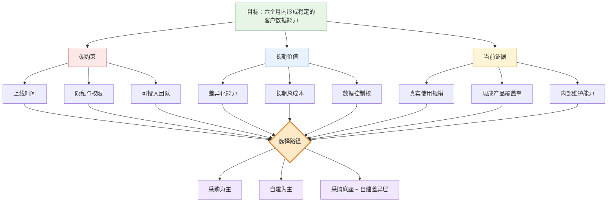

# 复杂思路示例：自建还是采购客户数据平台

## 使用场景

决策困难不在步骤，而在目标、约束、证据和二阶影响互相牵制。读者需要先看见判断结构，再比较方案。

## 第一层：决策结构

红色是不能靠偏好绕过的硬约束，黄色是仍需验证的证据，蓝色是长期价值。先区分三者，避免把“我更喜欢自建”伪装成业务要求。

## 第二层：方案比较

| 维度 | 采购为主 | 自建为主 | 采购底座 + 自建差异层 |
|---|---|---|---|
| 六个月上线 | 强 | 弱 | 中强 |
| 权限与合规 | 取决于供应商能力 | 可深度控制但建设成本高 | 底座需审查，差异层可控 |
| 初期团队压力 | 低 | 高 | 中 |
| 差异化空间 | 低 | 高 | 中高 |
| 可逆性 | 中，受迁移成本影响 | 低，沉没成本高 | 高，可逐步替换底座 |
| 主要未知 | 真实覆盖率和锁定成本 | 维护能力和交付速度 | 边界设计是否稳定 |

表格展示同一维度下的差异，不提前替读者做价值排序。只有当硬约束和关键未知有足够证据时，才形成推荐。

## 第三层：可能改变结论的问题

1. 现成产品是否覆盖最关键的 80% 业务旅程？
2. 数据能否完整导出，迁移成本是否可控？
3. 内部团队是否能在六个月内持续投入，而非只完成首版？

这些问题比继续增加比较维度更有价值，因为任一答案都可能改变推荐方向。

## 不推荐的呈现

- 先写“自建更灵活”，再寻找支持它的理由。
- 罗列十几个维度但不区分硬约束、价值偏好和未知证据。
- 只比较首年费用，忽略迁移、维护和组织能力的二阶影响。
