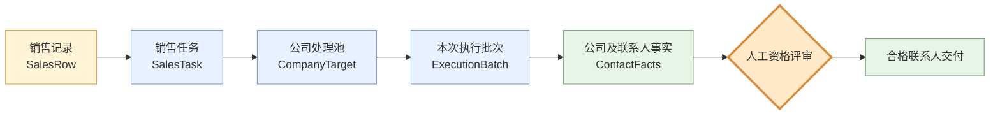
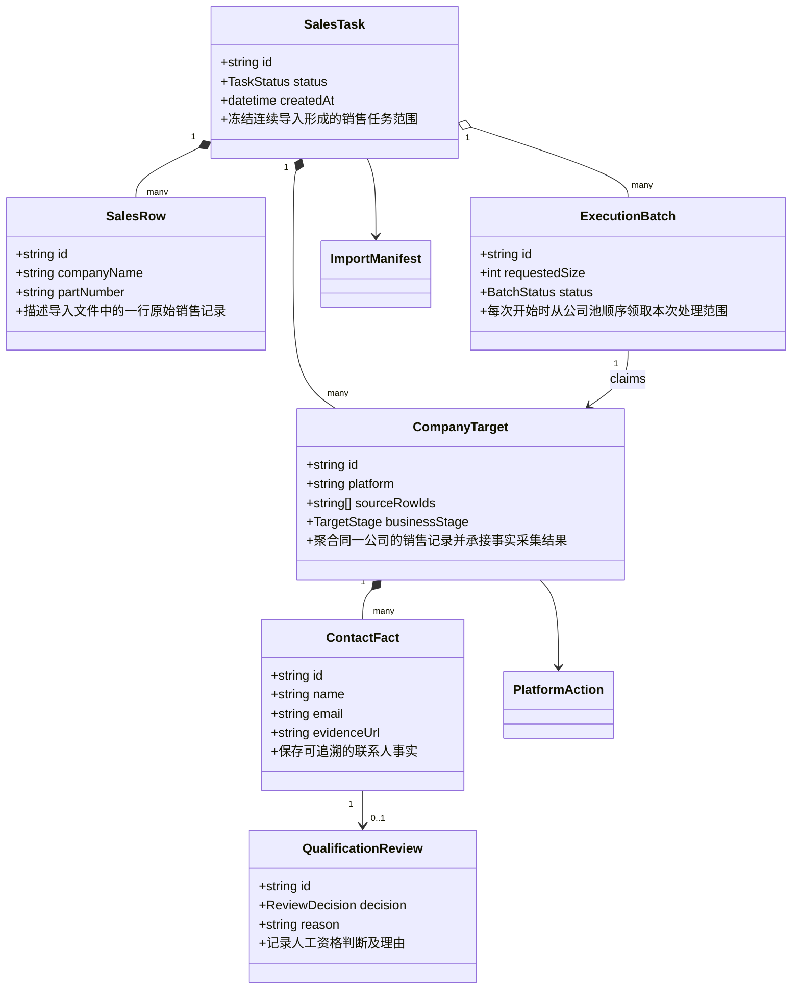
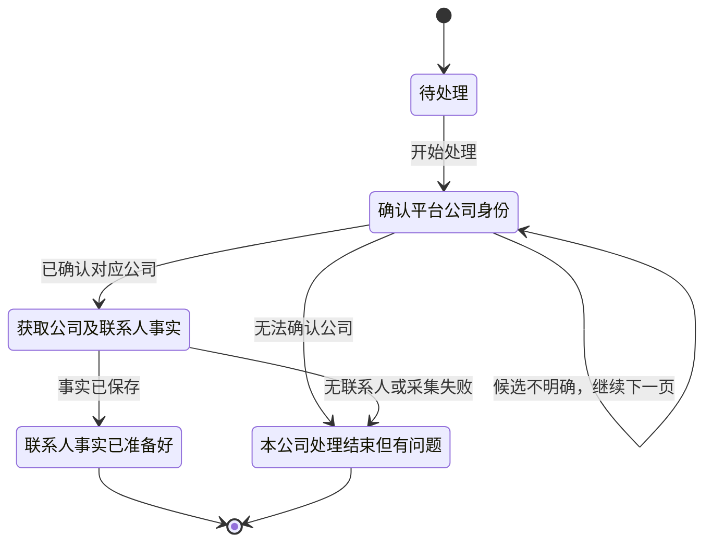

# 工程系统示例：销售任务到合格联系人

## 使用场景

读者需要先理解总数据结构和总流程，再进入某个模块的详细 Spec。系统包含导入记录、公司处理单元、按次启动的执行批次、联系人事实和人工资格评审。

## 第一层：一屏全景

黄色是输入，蓝色是系统处理主线，橙色是必须停下来的人工边界，绿色是稳定事实和交付结果。总览只回答处理范围和交付边界，不展开字段与异常。

## 第二层：核心类图

`CompanyTarget` 是核心聚合：它保留来源记录、冻结平台，并承接从公司身份确认到联系人事实落库的结果。浅层对象只显示名称，让读者知道它们存在；字段与 SQL 表映射放到实现章节。

## 第三层：业务状态

翻页、打开详情和持久化属于系统下一动作，不冒充 `CompanyTarget` 的业务状态；浏览器页签占用则属于资源状态，应另图表达。

## 不推荐的呈现

- 在一张类图中展开所有数据库字段、浏览器页签和错误码。
- 使用 `resolving`、`collecting`、`committed`，却不说明处理对象和业务结果。
- 为减少交叉线，把 `ExecutionBatch` 放到与 `SalesTask` 无关的位置，破坏聚合语义。
