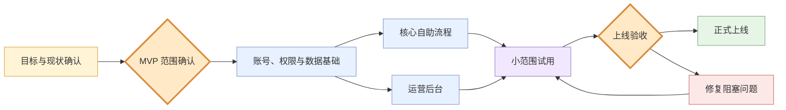

# 项目方案示例：分阶段上线客户门户

## 使用场景

读者需要判断项目怎样分阶段、哪些工作可以并行、哪里必须确认，以及 MVP 在哪里停止。

## 第一层：阶段全景

两个橙色节点是不可静默跨越的决策门。核心自助流程和运营后台可以并行，但都依赖同一套账号、权限与数据基础。

## 第二层：交付物与责任

| 阶段 | 核心交付物 | 完成判据 | 次级工作 |
|---|---|---|---|
| 目标与范围 | MVP 边界、非目标、关键旅程 | 利益相关者确认同一停止位置 | 长期愿望清单 |
| 基础能力 | 登录、角色权限、基础数据 | 三类角色只能访问授权范围 | 高级审计报表 |
| 核心流程 | 客户提交并查看处理结果 | 一条主旅程端到端跑通 | 个性化推荐 |
| 运营后台 | 运营人员处理异常和补录 | 异常不需要修改数据库 | 自动化运营策略 |
| 试用与上线 | 真实样本、问题清单、验收结果 | 阻塞问题清零并人工批准 | 全量性能优化 |

表格承担并列属性，不把每个交付物强行画成流程节点。次级工作明确存在，但不会扩张 MVP。

## 第三层：当前阶段高亮

讨论“核心自助流程”时复用第一张图，只把 `CORE` 加深或加粗；随后再画该阶段的详细用户旅程。不要重新命名为“前台模块”并另起一套阶段体系。

## 不推荐的呈现

- 用一张甘特图同时表达范围、依赖、责任和验收，导致读者只看到日期。
- 所有阶段平均展开，让 MVP 主链路和未来优化同样醒目。
- 把“预计两周”当成完成标准，而不说明可观察交付物。
