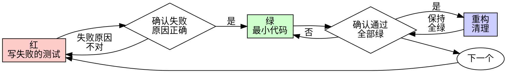

# 测试驱动开发（TDD）

## 概述

先写测试。亲眼看它失败。再写让它通过的最小代码。

**核心原则：** 没有亲眼看到测试失败，你就不知道它测的是不是对的东西。

**违反规则的字面，就是违反规则的精神。**

## 调用前提

- 用户显式调用本 Skill 时直接使用。
- 否则先说明当前任务、预期收益和主要成本，获得用户明确同意后再开始。
- **适用范围检查（先做）：** 本 Skill 只在有可运行测试基础设施的项目中生效。开始前确认项目存在测试框架和测试命令（如 `npm test` / `pytest` / `cargo test` / `go test`）。项目没有测试基础设施时，如实说明本 Skill 不适用，是否先搭建测试基础设施由用户决定；不要在没有测试框架的项目里空转本 Skill 的规则。

## 何时使用

**始终使用：**
- 新功能
- Bug 修复
- 重构
- 行为变更

**例外（询问用户）：**
- 一次性原型
- 生成的代码
- 配置文件

正在想“这次就跳过 TDD 吧”？停下。那是自我合理化。

## 铁律

```
没有先失败的测试，就不许写生产代码
```

在测试之前写了代码？删掉，重来。

**没有例外：**
- 不许留作“参考”
- 不许一边写测试一边“改造”它
- 不许看它
- 删除就是删除

从测试出发重新实现。就这样。

## 红-绿-重构



### 红——写失败的测试

写一个最小的测试，表达应该发生什么。

<Good>
```typescript
test('retries failed operations 3 times', async () => {
  let attempts = 0;
  const operation = () => {
    attempts++;
    if (attempts < 3) throw new Error('fail');
    return 'success';
  };

  const result = await retryOperation(operation);

  expect(result).toBe('success');
  expect(attempts).toBe(3);
});
```
名字清晰，测真实行为，只测一件事
</Good>

<Bad>
```typescript
test('retry works', async () => {
  const mock = jest.fn()
    .mockRejectedValueOnce(new Error())
    .mockRejectedValueOnce(new Error())
    .mockResolvedValueOnce('success');
  await retryOperation(mock);
  expect(mock).toHaveBeenCalledTimes(3);
});
```
名字含糊，测的是 mock 不是代码
</Bad>

**要求：**
- 一个行为
- 名字清晰
- 真实代码（除非不可避免，不用 mock）

### 确认红——亲眼看它失败

**强制步骤。绝不跳过。**

```bash
npm test path/to/test.test.ts
```

确认：
- 测试失败（不是报错）
- 失败信息符合预期
- 失败原因是功能缺失（不是拼写错误）

**测试直接通过了？** 你在测已有行为。改测试。

**测试报错了？** 修掉错误，重跑，直到它以正确的原因失败。

### 绿——最小代码

写能让测试通过的最简单代码。

<Good>
```typescript
async function retryOperation<T>(fn: () => Promise<T>): Promise<T> {
  for (let i = 0; i < 3; i++) {
    try {
      return await fn();
    } catch (e) {
      if (i === 2) throw e;
    }
  }
  throw new Error('unreachable');
}
```
刚好够通过
</Good>

<Bad>
```typescript
async function retryOperation<T>(
  fn: () => Promise<T>,
  options?: {
    maxRetries?: number;
    backoff?: 'linear' | 'exponential';
    onRetry?: (attempt: number) => void;
  }
): Promise<T> {
  // YAGNI
}
```
过度设计
</Bad>

不要加功能、不要顺手重构别的代码、不要做超出测试要求的“改进”。

### 确认绿——亲眼看它通过

**强制步骤。**

```bash
npm test path/to/test.test.ts
```

确认：
- 测试通过
- 其它测试仍然通过
- 输出干净（没有报错和警告）

**测试失败？** 改代码，不改测试。

**其它测试失败？** 现在就修。

### 重构——清理

只在全绿之后：
- 消除重复
- 改进命名
- 提取辅助函数

保持测试全绿。不添加行为。

### 重复

为下一个功能写下一个失败的测试。

## 好的测试

| 特性 | 好 | 坏 |
|------|----|----|
| **最小** | 只测一件事。名字里有“和”？拆开。 | `test('validates email and domain and whitespace')` |
| **清晰** | 名字描述行为 | `test('test1')` |
| **表达意图** | 演示想要的 API | 让人看不出代码该做什么 |

写或改任何测试时，阅读 [writing-good-tests.md](writing-good-tests.md)，里面是让测试保持诚实的规则：

- 写测试之前，先说出哪种生产代码改动会让它失败
- 断言真实行为，绝不断言 mock 的行为
- 只给测试用的代码放进测试工具，不进生产类
- 弄清依赖的副作用之后再 mock 它

## 面向人的交付

- 测试名描述行为、按行为分组（describe 按场景组织），让测试名列表读起来就是行为规格。
- 一段开发完成后，用户需要了解测试全貌时，使用 test-map Skill 交付“场景 → 情形 → 案例”三层的测试地图；项目已有地图时只汇报增量。

## 常见自我合理化

| 借口 | 现实 |
|------|------|
| “太简单了不用测” | 简单代码也会坏。写测试只要 30 秒。 |
| “我之后补测试” | 事后补的测试立即通过——这什么也证明不了。它可能测错了东西、测了实现而不是行为、漏掉你忘了的边界情况。你从没看它失败过，所以你从没证明它能抓住 Bug。先写测试逼出这次失败。 |
| “事后测试也能达到同样目的（重精神不重形式）” | 事后测试回答“这段代码做了什么”；先写测试回答“这段代码应该做什么”。事后写的测试被你已经写好的代码带偏——你验证的是你记得的分支，不是你本该发现的分支。那是没有证明测试有效的覆盖率。 |
| “我已经手工测过了” | 手工测试是临时的：没有覆盖记录，代码改了没法重跑，压力之下容易漏。“我试的时候好的”≠ 全面。自动化测试每次跑法都一样。 |
| “删掉 X 小时的工作太浪费” | 沉没成本谬误——那些时间横竖已经花了。真正的选择是：用 TDD 重写（高置信度），还是留着它事后贴测试（低置信度，多半有 Bug）。留着你无法信任的代码才是浪费。 |
| “留作参考，先写测试” | 你会照着它改。那就是事后测试。删除就是删除。 |
| “我需要先探索一下” | 可以。扔掉探索的产物，从 TDD 开始。 |
| “测试难写 = 还没想清楚设计” | 听测试的。难测 = 难用。 |
| “TDD 会拖慢我” | TDD 才是务实的路：在提交前抓住 Bug，防止回归，让你重构无惧。“务实”的捷径意味着到生产环境去调试——更慢，不是更快。 |
| “手工测更快” | 手工测证明不了边界情况。每次改动你都得重测一遍。 |
| “现有代码本来就没测试” | 你在改进它。给现有代码补上测试。 |

## 危险信号——停下，重来

- 先写了代码再写测试
- 实现之后才写测试
- 测试立即通过
- 说不清测试为什么失败
- 测试“以后再加”
- 自我合理化“就这一次”
- “我已经手工测过了”
- “事后测试能达到同样目的”
- “重要的是精神不是形式”
- “留作参考”或“改造现有代码”
- “已经花了 X 小时，删掉太浪费”
- “TDD 太教条，我是在务实”
- “这次不一样，因为……”

**以上任何一条都意味着：删掉代码，用 TDD 重来。**

## 示例：修 Bug

**Bug：** 空邮箱被接受了

**红**
```typescript
test('rejects empty email', async () => {
  const result = await submitForm({ email: '' });
  expect(result.error).toBe('Email required');
});
```

**确认红**
```bash
$ npm test
FAIL: expected 'Email required', got undefined
```

**绿**
```typescript
function submitForm(data: FormData) {
  if (!data.email?.trim()) {
    return { error: 'Email required' };
  }
  // ...
}
```

**确认绿**
```bash
$ npm test
PASS
```

**重构**
需要校验多个字段时再提取校验逻辑。

## 完成前检查清单

标记工作完成之前：

- [ ] 每个新函数/方法都有测试
- [ ] 每个测试都在实现前亲眼看它失败过
- [ ] 每个测试的失败原因都正确（功能缺失，不是拼写错误）
- [ ] 每个测试都只写了让它通过的最小代码
- [ ] 所有测试通过
- [ ] 输出干净（没有报错和警告）
- [ ] 测试用真实代码（mock 仅在不可避免时）
- [ ] 覆盖了边界情况和错误路径

有勾不上的？你跳过了 TDD。重来。

## 卡住时

| 问题 | 办法 |
|------|------|
| 不知道怎么测 | 写出你希望存在的 API。先写断言。问用户。 |
| 测试太复杂 | 设计太复杂。简化接口。 |
| 什么都得 mock | 代码耦合太紧。用依赖注入。 |
| 测试准备代码庞大 | 提取辅助函数。还是复杂？简化设计。 |

## 与调试的衔接

发现 Bug？写一个能复现它的失败测试，然后走 TDD 循环。这个测试既证明修复有效，又防止回归。

绝不在没有测试的情况下修 Bug。

## 最终规则

```
生产代码 → 存在对应测试，且它先失败过
否则 → 不是 TDD
```

未经用户允许，没有例外。
