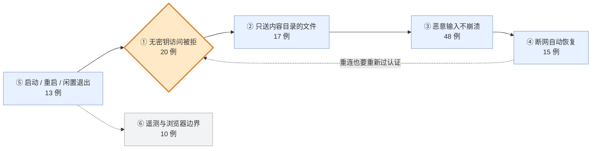

# upstream/superpowers 测试地图

## 30 秒版：六个场景，测试保证了什么

> 对象是 brainstorm-server——Superpowers 里唯一开网络端口、给人看页面的组件（123/142 例都在它身上）。

| # | 当这个场景发生时 | 测试保证的结果 | 担保 |
|---|---|---|---|
| 1 | 有人拿到链接但没有密钥来访问 | 页面、文件、WebSocket 一律拒绝；密钥首次使用后从地址栏消失，换成 HttpOnly cookie | 20 例 |
| 2 | 有请求试图读内容目录之外的文件（软/硬链接、点文件、空文件名） | 全部拦下；只有内容目录里最新的屏幕文件会被送出 | 17 例 |
| 3 | 客户端发来畸形、残缺或超大的消息，或多个连接同时进来 | 不崩溃、不乱记录、不为超大帧提前分配内存 | 48 例 |
| 4 | 你开着页面时网络断了 | 显示“重连中”，按 500→1000→2000ms 退避重试；恢复后自动接回会话，不用手动刷新 | 15 例 |
| 5 | 端口被占用 / 服务器重启 / 你忘了关 | 自动换端口并强制换新密钥；重启后原链接照常可用；闲置到点自动退出 | 13 例 |
| 6 | 你关闭了遥测、没有授权自动打开浏览器 | 真的不发外部图片请求、不弹窗；Windows/WSL 下 URL 不经过 cmd.exe | 10 例 |

场外另有两块：hermes 插件引导（19 例：skill 注册与目录一致、引导内容干净不超长）、各平台安装脚本（28 个：插件装得上、点名 Skill 叫得应）。

**只想知道现状，读到这里就够了。** 下面是给要深入某个场景的人的展开。

---

## 地图：场景在流程中的位置

橙色是认证门——全套件测得最重的位置。测试密度跟着风险走：开网络端口的组件厚，纯文本 Skill 一个用例都没有。

## 展开：每个场景的具体情形

### 场景 1：无密钥访问（20 例）

| 具体情形 | 结果 | 例数 |
|---|---|---|
| 不带密钥或密钥错误，访问页面 / 文件 / WebSocket | 一律 403 或拒绝升级 | 8 |
| 密钥通过验证后 | 地址栏里的密钥被抹掉，换发 HttpOnly SameSite=Strict cookie；所有响应带防泄漏/防嵌入头 | 6 |
| 其它网站的页面带着有效 cookie 发起 WebSocket | 同源放行，跨源拒绝 | 2 |
| 正常访客后续访问 | 凭 cookie 一路可用 | 4 |

原始用例名（20）

GET / without key is rejected with 403 · GET / with wrong key is rejected with 403 · GET / with wrong key and valid cookie is rejected with 403 · GET /files without key is rejected with 403 · WS upgrade without key is rejected · WS upgrade with valid cookie but cross-origin Origin is rejected · WS upgrade with valid cookie and same-origin Origin opens · 403 page names "coding agent" and the key · 403 responses include leak-reduction and anti-framing headers · GET / with valid query returns bootstrap instead of screen content · bootstrap strips the key URL even when sessionStorage write fails · valid key load sets an HttpOnly SameSite=Strict cookie · GET / with valid cookie (no query key) serves the screen · GET /files with valid key serves the file · WS upgrade with valid key opens · WS upgrade with valid cookie opens · HTML responses include leak-reduction and anti-framing headers · /files responses include leak-reduction and anti-framing headers · server-started url includes the session key · null payload over an authed WS does not crash the server

### 场景 2：越权读文件（17 例）

| 具体情形 | 结果 | 例数 |
|---|---|---|
| 请求经软链接、硬链接、点文件或空文件名指向内容目录之外 | 四条路径全部拒绝；空文件名 404 不崩溃 | 6 |
| 内容目录里有多个文件 | 只把最新的 html 当作当前屏幕；非 html 和 macOS 的 `._*` 文件忽略 | 3 |
| Agent 写入完整 HTML / 片段 / 还没有内容 | 完整文档原样送出，片段套框架模板并注入 helper.js，无内容时给等待页 | 6 |
| 访问不存在的路径 / 服务器启动 | 404；启动时输出 server-started JSON 和 server-info | 2 |

### 场景 3：恶意或极端输入（48 例）

| 具体情形 | 结果 | 例数 |
|---|---|---|
| 消息尺寸从 0 字节到 65536+ 字节（含 125/126/65535/65536 边界） | 手写的 WebSocket 帧编解码全部正确 | 25 |
| 收到残缺帧、未掩码的客户端帧、超大帧 | 残缺的等待补齐、违规的拒收、超大的在分配内存前拒绝——都不崩溃 | 7 |
| 你在页面上点了选择 | 写入 state/events 供 Agent 读取；非选择事件不写；新屏幕出现时清空旧事件 | 7 |
| 多个客户端同时连接 / 内容文件被修改 | 并发正常、断开的连接被清理、html 变更自动推送刷新、畸形 JSON 不崩 | 9 |

这块用例最多的原因：零依赖政策下他们**手写了 WebSocket 协议实现**。手写协议，边界枚举就是必需品——哪天换成现成库，25 例可以整组退休。

### 场景 4：网络中断（15 例）

断网瞬间显示“重连中”→ 按 500→1000→2000ms 退避重试（封顶不无限缠）→ 超过宽限期显示“已断开”→ 网络恢复后凭 sessionStorage 里的密钥自动接回会话，没有存密钥则整页刷新重来。15 例对应这条路径上的每个转折点。

### 场景 5：启动、重启与退出（13 例）

| 具体情形 | 结果 | 例数 |
|---|---|---|
| 首选端口被其它程序占用 | 改用随机端口，密钥强制换新；用户显式指定的令牌宁可启动失败也不复用 | 3 |
| 服务器重启 | 端口和密钥从磁盘恢复，原链接照常可用；令牌文件权限自动收紧 | 3 |
| 长时间没人使用 | 闲置计时到点关闭连接并退出；未认证的请求不能重置计时 | 4 |
| 启动时 | 浏览器只在授权时（BRAINSTORM_OPEN）自动打开一次；IPv6 地址加方括号 | 3 |

### 场景 6：遥测与浏览器边界（10 例）

四种遥测关闭环境变量（`SUPERPOWERS_DISABLE_TELEMETRY` 等）任一生效时不再请求远程图片、保留本地品牌；Windows/WSL 打开浏览器时 URL 不经过 cmd.exe（防命令注入）；无显示器的 Linux 保持无头。

### 场外（19 例 + 28 脚本）

hermes 与平台安装

- **hermes（19）**：给模型的引导内容剥离 frontmatter、不超过上下文限制、包含 using-superpowers 正文；skill 注册与磁盘目录一一对应，缺失时大声报错；只在第一轮注入引导，后续轮次不重复。
- **平台安装（28 脚本）**：Claude Code 6（SDD 工作流、worktree 策略）、explicit-skill-requests 5（点名 Skill 必触发：单轮/多轮/长上下文/小模型）、OpenCode 5、brainstorm 服务脚本 3、其余平台安装与仓库自检 9。

## 测试是不是太多了？

1. **数量跟着风险走**：最厚的是网络端口（认证 20）和手写协议（边界 32），纯文本 Skill 零用例。这是健康分布。
2. **多不花你的钱，平铺才花**：142 例是机器执行的粒度；你阅读的粒度是 6 个场景。
3. **该警惕的不是“多”，而是说不清防什么坏的测试**——本套件里未发现。

---

*工作流试验产物，基于 upstream commit `b36e082`，全部由 grep 测试名生成，未读测试实现。可随时删除。*
